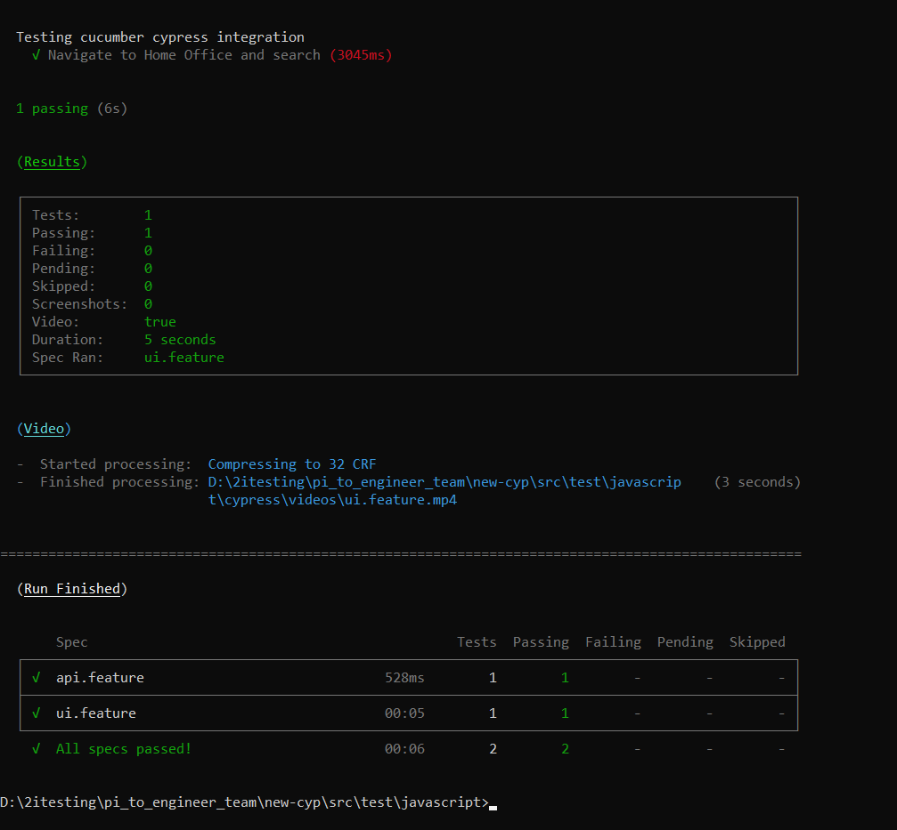

# Testing From A Generated Test Framework
## Cypress Testing Against The 2i Learning App

## Overview

* This guide will run through the steps involved in setting up a generated testing framework and writing BDD tests against an app. 
* The app we will be testing against is the 2i Learning App.
    * The guide assumes that you have followed the README on the [pi_to_engineering repo](https://github.com/2i-Git/pi_to_engineer_team), and can run the app's front-end and back-end.

* We will start by getting the framework in place and configuring it with the app.
* We will then write and run some basic API and UI tests from within the framework.
    * Some explanation of the different parts involved in the tests will be given, along with references and resources.

* This guide is written for a Windows user.
* The generator requires the use of 7zip to extract the framework from the .zip file.
* We will be using Visual Studio Code (VScode) to write our tests.

 

<strong>Installing 7-Zip</strong>

* You can check that you have 7-Zip installed by typing 7-Zip in the Windows Search bar.
* Alternatively you can right-click any file or folder and check that 7-Zip is in the menu.
* If you do not have 7-Zip installed you can install it from [7-zip.org](https://www.7-zip.org/download.html)
    * Select the 64-bit .exe installer and follow the instructions to install.

 

<strong>Navigating the Command Prompt</strong>

In later sections we will have to run code from within a Command Prompt terminal. To do this you need to be able to navigate to the correct folder from within the terminal.

* Open a new Command Prompt by typing 'cmd' in the search bar and selecting Command Prompt

* Navigating to a folder.
    * The folder you are in appears before the flashing cursor.
    * Type dir and hit enter to see what subfolders and files are present.
    * Type cd *foldername* to go to a folder in the current directory.
        * If you start typing a folder name hit *tab* to auto-complete.
        * If you enter the wrong folder, cd .. will take you back to the previous folder.

* An example of what this could look like is shown.

* It is useful to practice navigating through folders in the Command Prompt terminal using the commands above - *however* for a quick shortcut to open a Command Prompt in the folder you desire:
    * Open the folder in File Explorer.
    * Click on the navigation bar at the top of the window.
    * Delete the path text which is highlighted.
    * Type cmd and hit *enter*.

 

## 1. Initial Setup

<strong>1.1 Getting the framework .zip and installing</strong>

* Download the generated framework .zip file.
    * Go to the email you received from 'Service' titled 'Generated Framework'.
    * Find the attached framework .zip file, right-click and download.
* Extract the framework to the app's root directory.
    * Go to your 'Downloads' folder (or wherever you downloaded the file).
    * Right-click the .zip file and go to 7-zip > Extract Files...
    * In the 'Extract to' field, enter the path to the app's root directory e.g., D:\2itesting\pi_to_engineer_team
        * This can easily be found by opening the folder and clicking on the navigation bar at the top of the window.
        * The names of the folders should collapse into a text path which can then be copied.

    

    * Un-tick the checkbox below next to the folder name as this will create an unnecessary folder.

    * Click Ok to extract the files.

    

* Install Cypress
    * Open a Command Prompt terminal and navigate to the framework root directory.
    * From here go to src\test\javascript
    * Once inside the javascript folder run the following:
    > npm install
    * This will install the packages which have been included in the package.json file - including Cypress.

<strong>1.2 Checking over what we have</strong>

* Open the framework in VScode.
    * Start VScode.
    * Under the 'Start' section select Open Folder.
    * Navigate to the framework folder and open.
* The framework's file explorer should have opened on the left of the window.

We will check over the framework's structure by looking at some sample tests which come with the framework.

* In \src\test\javascript we have cypress.json.
    * This file is used to store configuration values for the test suite.

* We also have the cypress folder which contains the test files and data.
    * The 'integration' folder holds our Cucumber .feature files. There should be two sample features - api and ui. Look at ui.feature to see an example of how feature files are structured.
    * The 'integration' folder also holds Javascript spec files. These are split into two folders for api and ui tests. Look at ui.spec.js to see how functions are written to carry out the tests.
    * The 'fixtures' folder holds .json files which contain test data to be used in the tests.
    * The 'plugin' and 'support' folders contain Javascript files which can modify or add to the functionality of the test suite.

Later we will go over how these files work but for now let's run the example tests we have.

<strong>1.3 Running the sample tests</strong>

* Open a Command Prompt terminal in the framework's root folder.
* Then navigate to src\test\javascript
    * See the Navigating the Command Prompt section for help.

* Once you are in the javascript folder enter the following command to run the tests:

    > npx cypress run

* You should see the framework's output in the terminal and eventually the sample tests should pass.

Further details about running tests and their outputs can be found in section 3.

<strong>1.4 BDD test structure</strong>

We will run through how the different test files work by looking at the sample UI test.

#### Cucumber Feature Files

The entry point of the test is the [Cucumber]( https://cucumber.io/docs/cucumber/) feature file.
* These files are written in descriptive ‘high level’ language
* Each feature file should test a different feature of the app.
* A feature can have multiple scenarios which are each broken down into steps of how the scenario is run.

In cypress\integration we have the ui.feature file. 
* We can see a description of the feature to be tested.
* The background section is ran before any test scenario.
* We have one test scenario – opening the Home Office website and carrying out a search.
* The scenario is described as individual steps starting with either Given, When or Then.
	* This [cheat sheet]( http://dontcodetired.com/blog/post/Gherkin-Cheat-Sheet) gives an idea of a scenario's structure
* The steps are broken into individual actions so that they can be carried out by a single function.

* The exact phrasing of the step links it to a step definition function which performs the action for that step.
* Quotation marks "" are used to send variables to the function.
    * We will see how this works by looking at the step definition

#### Step Functionality

Each feature file has a corresponding folder of the same name which contains implementations of the steps as javascript functions. A feature will look in the corresponding folder to find the functions which define what happens in each step - linked by the phrasing of the definition. For example:

* In cypress\integration\ui\ui.spec.js we have the step definitions for ui.feature.
* Notice the function with the step type 'Given' and the string 'I set the device for testing' matches the first step of the scenario in the corresponding feature.
* Inside the function we have the actions which are performed for the step.
    * Here that is calling a Cypress function to set the device.
    * Other functions involve opening the app, clicking buttons and checking text.
* On line 5 we can see an example of a function which takes a variable parameter from the feature.
    * Our feature has the web address of the Home Office in place of {word}.
    * This is the url which is passed into the function and used in the .visit() call.
    * This could be swapped out to use some other url.

We can see examples of Cypress functions such as visit and get. We can also see the use of an 'if statement' to perform different aactions depending on a condition. Step implementations can be built up like this to perform more complex actions. Check out the [Cypress documentation](https://docs.cypress.io/guides/overview/why-cypress) to get an idea of some of the other functionality available.

<strong>1.5 Configuring for our app</strong>

* Set the base URL for our app's front end.
    * In the framework's root directory open cypress.json.
    * Add a new key/value pair of "baseUrl": "*Front End IP*". e.g.
> "baseUrl": "http://192.168.56.1:8080",

This tells Cypress to open the Learning App when performing tests.

You may also want to tell Cypress not to produce video output of the tests running. These videos can help with ensuring the tests are running correctly and with debugging if tests fail, however, the tests will take longer to run.

* If you want to disable videos you can add:

> "video": false,

We are now able to write tests against the Learning App's UI and API.
From here on the Learning App's front and back end should be running.

 

## 2. Writing Tests

<strong>2.1 UI Testing</strong>

It's time to start writing our own tests for the Learning App. We'll start out with some UI testing.

First off we'll create a feature file.
* In VScode, open the integration folder - src\test\javascript\cypress\integration
* Add a new file by right-clicking on the folder in the explorer then New > File
* We'll name our file checkBasicText.feature and hit enter.
    * Our first tests will involve opening the app and checking the title and heading are correct.
Now we'll add the contents of the feature.
* Tags allow us to group our features so that we can run certain specified tests if we choose.
    ~~~
    @UITest @all
    ~~~
* In the Feature section we give a brief description of the feature of the app we are testing. Here we are looking to ensure some basic text in the app loads correctly.
    ~~~
    Feature: Check that the initial text in the app is correct
    ~~~
* Now we can define the scenario.
    ~~~
    Scenario: Navigating to learning app to check the title and headers
    ~~~
* Here's where we define the steps of the scenario - the Given, When, Then sections.
* Our Given step will be navigating to the Learning App
    ~~~
    Given I navigate to the learning app
    ~~~
* We will not be carrying out any action on the page for this test so no when statement is needed.
* Our Then steps will check different text on the page.
    ~~~
    Then The title reads "2i Learning App"
    And The header reads "2i Learning App"
    And The form header reads "Add your own data to the API"
    ~~~
    * Notice that 'And' acts as a continuation of the type of step before.

We now need to implement functionality for each of the steps of our feature.

* In the integration folder create a new subfolder with the same name as the feature file - checkBasicText.
* Right-click the new folder and select New File.
* Name the file checkBasicText.spec.js and hit enter.

For each of the steps in our feature we must add a function to perform the action.

* The given step can be implemented by adding the following.

~~~
Given('I navigate to the learning app', ()=>{
    cy.visit('/')
})
~~~

* The first line links the definition to it's step.
* The function then calls .visit('/') which tells Cypress to open the URL given in cypress.json

* Define the following steps in a similar way.

~~~
Then('The title reads {string}', (title)=>{
    cy.title()
        .should('eq', title)
})

And('The header reads {string}', (header)=>{
    cy.get('body > h1')
        .should('contain', header)
})

And('The form header reads {string}', (header)=>{
        cy.get('#contact > h3')
            .should('contain', header)
})
~~~

* These steps each check that a part of the app's text is what should be expected. The expected text is passed in from the feature file to the function as a parameter.

We should now have step definitions for each step of our feature file.
Other features could be:

* adding new people and checking they show up on the page
* deleting people from the page
* trying to add a person with incomplete data

Now that we have our own UI test we can delete the sample feature and spec folder. Before we get on to running our tests lets look at API testing.

<strong>2.1 API Testing</strong>

The structure of our API tests will be very similar to our UI tests. When using Cypress, the test structure only differs in the functions that are called in our step definitions.

* Feature files with test steps
* API step files with step definitions

We can modify the api.feature file to runa a quick API test against the Learning App's people endpoint.

* In api.feature, changing the endpoint in the step is enough to point the tests to our app.
    * Change the https://restcountries.eu/rest/v2/name/Denmark endpoint to the app's people endpoint.
    * This will be of the form "http://*RaspberryPi IP*:3000/people"
* In api.spec.js, notice we have functions to check the endpoint is available and to validate the response code we get.
* Response status code 200 signifies a successful request.

API tests should usually look at Creation, Reading, Updating and Deletion of data from the database via the API. Here is some more information on [API testing with Cypress](https://www.mariedrake.com/post/api-testing-with-cypress). For now we will move on to look at running the tests.

 

## 3. Running Tests and Framework Output

<strong>3.1 Running Your Tests</strong>

* Open a Command Prompt terminal in the framework's root folder.
* Then navigate to src\test\javascript
    * See the Navigating the Command Prompt section for help.

The command to run all tests is:

> npx cypress run

* Navigate to your framework folder in a Command Prompt and try running the tests.

The command to run a single test is: 

> npx cypress run --spec **/**/ui.feature

Additional options may also be passed, for example to run tests without recording a video:

> npx cypress run --config video=false

<strong>3.2 Test Output</strong>

The terminal will output some progress on the running of the tests. Eventually when the tests finish you should get a summary of which tests passed or failed.

Given our tests were very basic examples we should hopefully see both pass.

<image>

You can scroll back through the terminal to see more detailed feedback. If there are problems with the tests error messages will appear under the steps which caused them.

Cypress will also produce a video of the test running. This can be useful to see if the test steps are running as intended and that they produce the correct results. They can also help with the debugging of failed tests.

 

##Running gatling performance tests
####Run a smoke test 
This test will ramp up with one user and run with one user:

mvn gatling:test

####Run a test with specific volumes This test will run the simulation with the specific volumes passed in using the following command:
mvn gatling:test -Dgatling.simulationClass=Gatling.simulation.RunSimulation -DRAMP_USERS=10 -DRAMP_DURATION=10 -DCONSTANT_USER_COUNT=20 -DCONSTANT_USER_DURATION=20 

